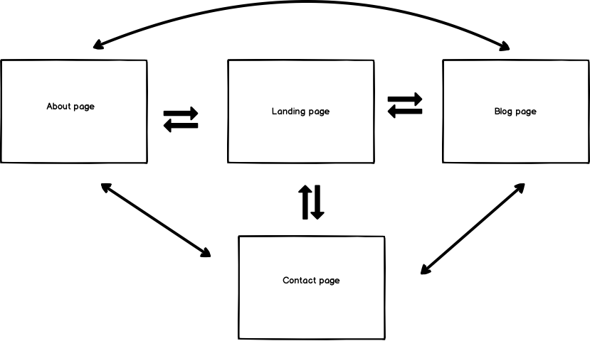
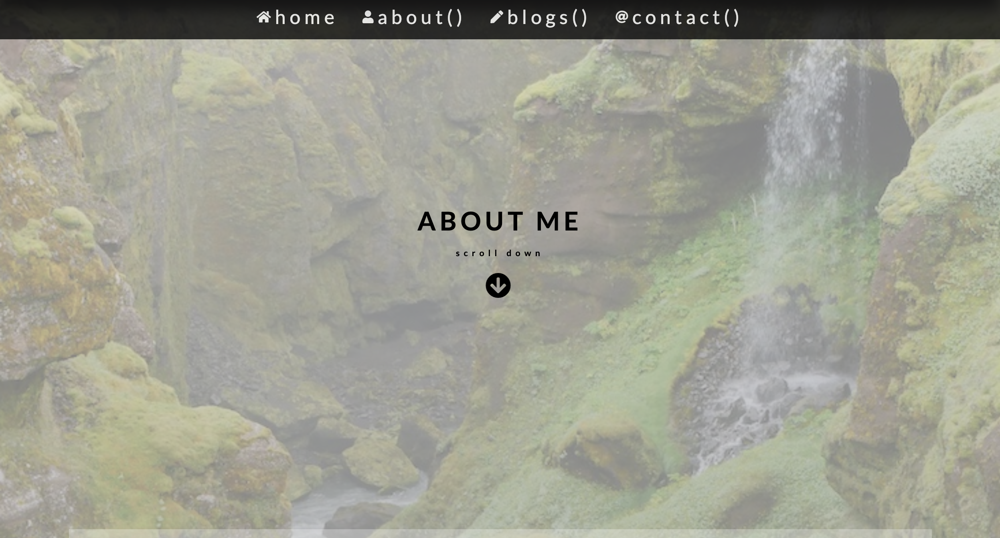
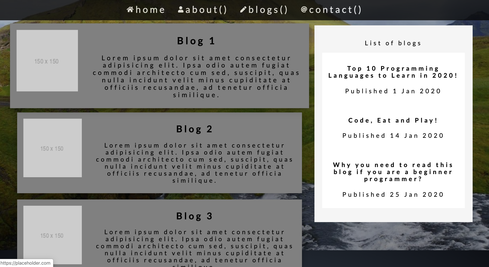

# Portfolio Website T1A3

Website published - https://lingyenlee.netlify.com/
Github repo - https://github.com/lingyenlee/my_portfolio

main - master branch
color change - new_color branch
font change - new_font branch
new layout chnage - new_layout branch

### Purpose

The purpose serves 3 purposes:

1. to showcase the skills of using HTML and CSS/SASS to build a fully responsive website.
2. as a personal website to show to future potential employers.
3. as a repository for future projects.

### Functionality / features

1. Responsiveness
   The website is responsive to viewports of 3 sizes - phone (not more than 600px), tablet (between 600px and 768px) and desktop (min 1024px). This is acheived with the use of flexbox, media queries and typography. Depending on the viewport, properties such as the fontsize, width, flex direction, to name a few, will re-adjust accordingly. Some examples that are used in this website to make responsive web include:

   - by including the following in the `<head>` tag
     `<meta name="viewport" content="width=device-width, initial-scale=1.0">`

   - using rem/em to specify font size and vh for height as these are relative units.

   - using flexbox property such as flex direction to change the content from row to column to fit viewport

   - using media query (set up using SASS/SCSS mixins) to resize whole document based on 3 viewports mentioned earlier.

2) Navigation using navbar
   A navbar appears on every webpage to enable users to navigate to different sections of the website.

3) Semantic HTML
   Semantic HTML such as section, article, nav are used here to provide structure to the whole document.

4) User Interactivity
   The website allows users to download CV, links to other sites (LinkedIn Page and Github Page) and also open a default email program to send email to me.

5) Parallax
   Parallax scrolling is a powerful web layout technique, when used with good design, can maximise users' experience. In this website, I build a simple parallax effect with vertical scrolling. The aim is to create a 3D effect such that the content in the foreground (eg text) moves at different speed to those in the background (eg image). This is acheived by first locking the whole document to a perspective, then other layers of content, translating along the Z axis, are added to the fixed perspective. This creates a sense of depth, however there is a side effect during Z-axis translation, which is corrected with scaling.

6) Accessibility
   This website applies the concept of accessibility to help users with disability with the following:
7) using the alt tag to provide a brief description of the images if they don't show up
8) making the navigation icons bigger in the phone viewport

9) Subresource integrity
   The website uses subresource integrity to protect malicious code from being injected through the internal stylesheets/scripts or external ones (eg CDNs, google fonts stylesheets) when they are being loaded onto the browser.

Web security is done by generating a hash and prefix with either sha56-, sha384- or sha512- and then add to the integrity attribute of the `<link> or <script>` tags. For this website, the integrity attribute has been added to its own internal stylesheet as well as 2 external ones frome Google font and Fontawesome.

### Sitemap

### Screenshots

The following are screenshots from the portfolio website:

##### landing page

##### about page

##### blog page

##### contact page

### Target audience

1. Potential employers
2. Other web developers

### Tech stack

- HTML
- SASS/SCSS
- CSS authoring framework - Compass
- Balsamiq for wireframes
- Netlify for deployment
- Github for version control
